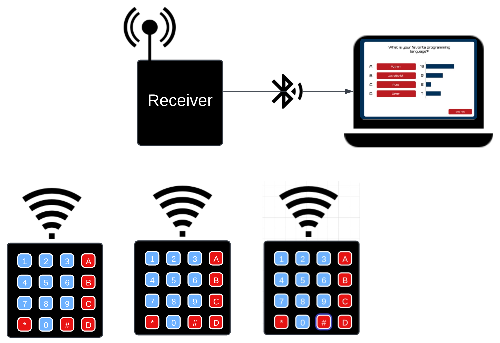

# Promptly

<div class="title_screenshot">


</div>

**Promptly** is a software + hardware solution for obtaining real-time feedback in the classroom using wireless "clickers".


# Hardware


## Clicker
To build a clicker you will need the following:
 - [ESP32 Lora V3](https://www.amazon.com/MakerFocus-Development-Bluetooth-0-96inch-Display/dp/B076MSLFC9/ref=asc_df_B076MSLFC9?mcid=9bc7a0a6ae5234c8a5f3c1db3f58b687&tag=hyprod-20&linkCode=df0&hvadid=693369603351&hvpos=&hvnetw=g&hvrand=2764983070318038207&hvpone=&hvptwo=&hvqmt=&hvdev=c&hvdvcmdl=&hvlocint=&hvlocphy=9029961&hvtargid=pla-570414542843&th=1)
 - [4x4 adhesive keypad](https://www.amazon.com/outstanding-Adhesive-Membrane-Keyboard-Prototyping/dp/B08JYNM8D9/ref=asc_df_B08JYNM8D9?mcid=b772a2d4b59c338c9e655af088d7bd85&tag=hyprod-20&linkCode=df0&hvadid=693507718463&hvpos=&hvnetw=g&hvrand=350680816331274110&hvpone=&hvptwo=&hvqmt=&hvdev=c&hvdvcmdl=&hvlocint=&hvlocphy=9029961&hvtargid=pla-1952852187497&psc=1)
 - [3000 mAh rechargable battery](https://www.amazon.com/3000mAh-Rechargable-Protection-Insulated-Development/dp/B08T6GT7DV/ref=asc_df_B08T6GT7DV?mcid=741a2dcb69ca3c04abfd36d0e8c549cf&tag=hyprod-20&linkCode=df0&hvadid=693447424243&hvpos=&hvnetw=g&hvrand=12235300328962464896&hvpone=&hvptwo=&hvqmt=&hvdev=c&hvdvcmdl=&hvlocint=&hvlocphy=9029961&hvtargid=pla-2187321104549&th=1)
 - 3D Printed Housing [here](3d_models)

## Receiver
The receiver takes the exact same hardware as the clicker and even fits in the same box. It does not need the adhesive keypad.

## Installation
The software that goes on each Clicker is located [here](sender/sender.ino).

> **__NOTE:__** Each Clicker needs a unique ID in order to properly prevent multiple responses from the same clicker. This must be configured in the sender.ino file.

The software that goes on the receiver is located [here](receiver/receiver.ino).

The web app is hosted for you [here](https://ut-promptly.netlify.app/), so there is no need to run it locally.

If you do want to run it locally, you can do so by navigating to the ```web_app``` directory and running 
```
npm install
npm run dev
```